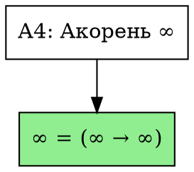

# aprover
**Публичный URL**: [https://netkeep80.github.io/aprover/](https://netkeep80.github.io/aprover/)

Ассоциативный прувер для формальной нотации Метатеории Связей (МТС)

## Описание проекта

**aprover** — это веб-приложение на Vue.js + TypeScript для парсинга, визуализации и верификации выражений в формальной нотации МТС (Метатеории Связей). Приложение публикуется на GitHub Pages.

### Что такое МТС?

Метатеория Связей (МТС) — это онтологически замкнутая система, в которой **всё есть связь**. В отличие от классических логических систем (ZFC, теория типов, категории), МТС:

- Не допускает онтологического дуализма — нет разделения на "носитель" и "отношение"
- Знак не ссылается на внешний объект, а является **запросом по форме** в "океане связей"
- Доказательство = резолюция запроса по форме в асети связей

## Документация МТС

Теоретические основы Метатеории Связей изложены в структурированной документации: **[docs/mts/README.md](docs/mts/README.md)**

### Карта документации

```
docs/mts/
├── README.md                          Оглавление и навигация
│
├── 01-foundations/                    ФУНДАМЕНТАЛЬНЫЕ ОСНОВЫ
│   ├── 01-introduction.md             ├─ Введение в МТС
│   ├── 02-ontology.md                 ├─ Онтология различения
│   └── 03-signs-as-queries.md         └─ Знаки как запросы
│
├── 02-axioms/                         СИСТЕМА АКСИОМ (А0-А11)
│   ├── 01-overview.md                 ├─ Обзор системы
│   ├── 02-aroot.md                    ├─ А4: Акорень ∞
│   ├── 03-definition.md               ├─ А0: Определение
│   ├── 04-identity.md                 ├─ А1: Тождественность
│   ├── 05-congruence.md               ├─ А2: Конгруэнция
│   ├── 06-link.md                     ├─ А3: Связь
│   ├── 07-closure.md                  ├─ А5-А6: Самозамыкание
│   ├── 08-inversion.md                ├─ А7: Инверсия
│   ├── 09-semantics.md                ├─ А8-А9: Семантика
│   ├── 10-abits.md                    ├─ А10: Абиты
│   └── 11-associativity.md            └─ А11: Ассоциативность
│
├── 03-notations/                      НОТАЦИИ
│   ├── 01-overview.md                 ├─ Обзор нотаций
│   ├── 02-formal.md                   ├─ Формальная (.mtl)
│   ├── 03-string-anum.md              ├─ Строковая (.astr)
│   ├── 04-quaternary.md               ├─ Четверичная (.anum)
│   └── 05-ebnf.md                     └─ EBNF грамматика
│
├── 04-logic/                          ЛОГИКА И ВЫЧИСЛЕНИЯ
│   ├── 01-four-valued.md              ├─ 4-значная логика
│   ├── 02-guarded-recursion.md        ├─ Ограждённая рекурсия
│   └── 03-natural-numbers.md          └─ Натуральные числа
│
├── 05-prover/                         АРХИТЕКТУРА ПРУВЕРА
│   ├── 01-architecture.md             ├─ Общая архитектура
│   ├── 02-resolution.md               ├─ Алгоритм резолюции
│   ├── 03-modus-ponens.md             ├─ Modus Ponens
│   └── 04-interactive.md              └─ Интерактивный режим
│
├── 06-philosophy/                     ФИЛОСОФИЯ
│   ├── 01-comparison.md               ├─ Сравнение с ZFC/типами
│   └── 02-godel.md                    └─ Теоремы Гёделя
│
├── specification/                     СПЕЦИФИКАЦИИ
│   └── v0.1.md                        └─ Версия 0.1
│
└── archive/                           АРХИВ
    ├── formal-notation.md             ├─ Ранний черновик
    └── sign-link-gap.md               └─ Философские заметки
```

### Основные разделы

| Раздел | Описание |
|--------|----------|
| [Фундаментальные основы](docs/mts/01-foundations/) | Введение в МТС, онтология различения, семиотика |
| [Система аксиом](docs/mts/02-axioms/) | Полное описание 12 аксиом МТС v0.1 |
| [Нотации](docs/mts/03-notations/) | Три нотации: формальная, строковая, четверичная |
| [Логика](docs/mts/04-logic/) | 4-значная логика, рекурсия, натуральные числа |
| [Архитектура прувера](docs/mts/05-prover/) | Резолюция, Modus Ponens, интерактивный режим |
| [Философия](docs/mts/06-philosophy/) | Сравнение с ZFC, теорией типов, категориями |
| [Спецификация](docs/mts/specification/v0.1.md) | EBNF и ядро прувера |

### Быстрые ссылки
- [Обзор системы аксиом](docs/mts/02-axioms/01-overview.md)
- [Формальная нотация](docs/mts/03-notations/02-formal.md)
- [Архитектура](docs/mts/05-prover/01-architecture.md)

## Архитектура системы

### Три нотации МТС

| Нотация | Назначение | Алфавит | Формат файлов |
|---------|------------|---------|---------------|
| **Формальная** | Запросы по форме связей | `∞`, `->`, `!->`, `♂`, `♀`, `!`, `:`, `=`, `!=`, `{}`, `()` | `.mtl` |
| **Строковые ачисла** | Человекочитаемая сериализация | Любой UTF-8 символ | `.astr` |
| **Четверичная** | Базовая сериализация для апамяти | `0`, `1`, `[`, `]` | `.anum` |

### Система аксиом МТС v0.1

| Аксиома | Формула | Описание |
|---------|---------|----------|
| А0. Определение | `(s : F) -> (s = F)` | Знак как запрос по форме |
| А1. Тождественность | `x = x`, `(x = y) -> (y = x)`, `{(x = y), (y = z)} -> (x = z)` | Рефлексивность, симметрия, транзитивность |
| А2. Конгруэнция | `{(a = c), (b = d)} -> ((a -> b) = (c -> d))` | Структурная прозрачность |
| А3. Связь | `be : (b -> e)` | Базовый конструктор |
| А4. Смысл (акорень) | `∞ : (∞ -> ∞)` | Полное самозамыкание |
| А5. Самозамыкание начала | `♂x : (♂x -> x)` | Начало замкнуто на связь |
| А6. Самозамыкание конца | `x♀ : (x -> x♀)` | Конец замкнут на связь |
| А7. Инверсия | `!(a -> b) = (b -> a)`, `!(♂x) = x♀`, `!(x♀) = ♂x`, `!∞ = ∞`, `!!x = x` | Дуальность |
| А8. Единица смысла | `1 : (♂∞ -> ∞♀)` | Направленная связь |
| А9. Нуль смысла | `0 : !1` | Инверсия единицы |
| А10. Абиты | `'[' : ♂∞`, `']' : ∞♀`, `'1' : 1`, `'0' : 0` | Четверичная система |
| А11. Левоассоциативность | `(a -> b -> c) = ((a -> b) -> c)` | Порядок группировки |

## План разработки

- [Фаза 1](docs/PHASE1-PLAN.md) — Основная реализация (завершена)
- [Фаза 2](docs/PHASE2-PLAN.md) — Улучшение UI и расширение функциональности (завершена)
- [Фаза 3](docs/PHASE3-PLAN.md) — Файловые операции и поддержка всех нотаций МТС (завершена)
- [Фаза 4](docs/PHASE4-PLAN.md) — Modus Ponens и расширение прувера (завершена)
- [Фаза 5](docs/PHASE5-PLAN.md) — Рефакторинг документации МТС (завершена)
- [Фаза 6](docs/PHASE6-PLAN.md) — Расширение системы аксиом и улучшение ядра прувера (в процессе)

**Текущий статус:** Фаза 6 — Реализованы кэширование доказательств (этап 6.1) и метрики доказательств (этап 6.2).

## Программный API (v0.8.0)

aprover можно использовать как библиотеку. Полная документация доступна в [docs/API.md](docs/API.md).

### Быстрый старт использования как библиотеки

```typescript
import { parse, parseExpr } from './src/core/parser'
import { createProverState, verify } from './src/core/prover'

// Создание состояния прувера
const state = createProverState()

// Парсинг и верификация выражения
const expr = parseExpr('∞ = ∞ -> ∞')
const result = verify(expr, state)

console.log(result.success ? 'Доказано!' : 'Не доказано')
```

### Основные модули

| Модуль | Описание |
|--------|----------|
| `src/core/ast.ts` | Типы AST и type guards |
| `src/core/lexer.ts` | Лексический анализатор |
| `src/core/parser.ts` | Синтаксический анализатор |
| `src/core/normalizer.ts` | Нормализация и канонизация |
| `src/core/prover.ts` | Ядро прувера и система аксиом |
| `src/core/interactive.ts` | Интерактивный режим доказательства |
| `src/core/proofExport.ts` | Экспорт доказательств |
| `src/core/proofCache.ts` | Кэширование результатов доказательств |
| `src/core/proofMetrics.ts` | Метрики и анализ сложности доказательств |
| `src/core/fileIO.ts` | Файловые операции (загрузка, сохранение, история) |
| `src/core/stringAnum.ts` | Парсер строковых ачисел (.astr) |
| `src/core/quatAnum.ts` | Парсер четверичных ачисел (.anum) |
| `src/core/index.ts` | Единая точка входа для библиотеки |

### Примеры использования

Примеры находятся в папке `examples/`:
- `library-usage.ts` — базовое использование прувера
- `interactive-proof.ts` — интерактивный режим
- `proof-export.ts` — экспорт в различные форматы

## Файловые операции (v0.2.0)

Приложение поддерживает работу с файлами:

### Клавиатурные сокращения
- **Ctrl+N** — Новый файл
- **Ctrl+O** — Открыть файл
- **Ctrl+S** — Сохранить код

### Панель инструментов
- **Новый** — создать новый файл с шаблоном
- **Открыть** — открыть файл `.mtl`, `.astr` или `.anum` с диска
- **Недавние** — список последних 10 файлов
- **Сохранить** — сохранить код в файл
- **Результаты** — экспорт результатов верификации в текстовый файл
- **JSON** — экспорт результатов в формате JSON

### Drag-and-Drop
Файлы `.mtl`, `.astr` и `.anum` можно перетащить прямо в редактор для загрузки.

### Автосохранение
Содержимое редактора автоматически сохраняется в localStorage каждые 30 секунд.

## Строковые ачисла (.astr) — v0.3.0

Поддержка строковых ачисел позволяет работать с данными в человекочитаемой форме:

### Что такое строковое ачисло?

Строковое ачисло — это последовательность UTF-8 символов в двойных кавычках, интерпретируемая как связь:

```
"связь" ≡ (∞ -> "связь")
```

Вся строка становится единым `StringLit` узлом, связанным с акорнем `∞`.

### Что такое абитовое ачисло?

Абитовое ачисло — это последовательность четверичных символов `[`, `0`, `1`, `]` в одинарных кавычках:

```
'01[]' ≡ (∞ -> '01[]')
```

Вся последовательность абитов становится единым `AbitLit` узлом. Допускаются только символы: `[`, `0`, `1`, `]`.

### Загрузка .astr файлов

При открытии файла `.astr`:
1. Каждая строка конвертируется в формальную нотацию
2. Отображается панель визуализации процесса преобразования
3. Результат автоматически верифицируется прувером

### Формат файла .astr

```
// Комментарии поддерживаются
связь
link
Hello, мир!
🌍🔗✨
```

### Визуализация конвертации

При загрузке `.astr` файла можно включить панель визуализации (кнопка "Show Conv"), которая показывает пошаговое преобразование строки в цепочку формальных запросов.

## Четверичные ачисла (.anum) — v0.4.0

Поддержка четверичной (абитовой) нотации — базовой формы сериализации связей для апамяти.

### Что такое четверичное ачисло?

Четверичное ачисло использует алфавит из ровно 4 символов (абитов):

| Абит | Форма МТС | Онтологический смысл |
|------|-----------|----------------------|
| `[`  | `♂∞`      | Начальный смысл — самозамкнутое начало |
| `]`  | `∞♀`      | Конечный смысл — самозамкнутый конец |
| `1`  | `♂∞ -> ∞♀` | Истина — наличие направленной связи |
| `0`  | `∞♀ -> ♂∞` | Ложь — отсутствие/инверсия связи |

### Вложенные контексты

Поддерживаются вложенные контексты с помощью квадратных скобок:

```
01010001[010100[1001]010]
```

### Загрузка .anum файлов

При открытии файла `.anum`:
1. Валидируется структура (только символы `0`, `1`, `[`, `]`, проверка баланса скобок)
2. Каждая строка конвертируется в формальную нотацию
3. Отображается панель визуализации с легендой абитов
4. Результат автоматически верифицируется прувером

### Формат файла .anum

```
// Комментарии поддерживаются
1
0
[]
0101
[01]
01010001[010100[1001]010]
```

### Визуализация конвертации

При загрузке `.anum` файла можно включить панель визуализации (кнопка "Show Conv"), которая показывает:
- Легенду соответствия абитов формам МТС
- Пошаговое преобразование последовательности абитов в цепочку формальных запросов

## Оптимизации производительности — v0.5.0

Приложение оптимизировано для работы с большими выражениями:

### Кэширование нормализации

Результаты нормализации AST кэшируются для повышения производительности при повторных вычислениях:
- LRU-подобная стратегия вытеснения (до 1000 записей)
- Отслеживание статистики: размер кэша, попадания, промахи, hit rate
- Возможность отключения кэширования при необходимости

### Ленивая загрузка AST

Узлы дерева AST загружаются по требованию для обеспечения быстрой работы с большими выражениями:
- Автоматическая загрузка узлов до глубины 10 уровней
- Пагинация для узлов с большим количеством детей (50 на страницу)
- Индикатор количества детей для свёрнутых узлов
- Кнопка "Load more" для загрузки дополнительных детей

## Modus Ponens — v0.7.0

Реализовано правило вывода Modus Ponens для автоматического доказательства:

### Что такое Modus Ponens?

Modus Ponens (MP) — это фундаментальное правило вывода: если доказано P и (P → Q), то доказано Q.

### Возможности

- **Автоматическое применение MP**: прувер автоматически применяет правило MP к известным фактам
- **Цепочки выводов**: поддержка цепочек P, P → Q, Q → R ⊢ R
- **Отслеживание импликаций**: все Link-выражения (a → b) регистрируются как импликации
- **Трассировка вывода**: отслеживание пути доказательства через MP

### Пример использования

```
// Регистрируем факт P
♂∞

// Регистрируем импликацию P → Q
♂∞ -> ∞♀

// Q автоматически выводится через MP
// Прувер покажет: "Из ♂∞ и (♂∞ → ∞♀) выводится ∞♀"
```

### Техническая реализация

- `addProvenFact(state, fact)` — добавить доказанный факт
- `addProvenImplication(state, P, Q, source)` — добавить доказанную импликацию
- `tryModusPonens(goal, state)` — попытаться доказать цель через MP
- `applyModusPonens(state)` — применить MP ко всем известным фактам

## Интерактивный режим доказательства — v0.8.0

Реализован интерактивный режим для пошагового управления процессом доказательства.

### Возможности

- **Пошаговое доказательство**: полный контроль над каждым шагом вывода
- **Три стратегии доказательства**:
  - `automatic` — прувер автоматически применяет все доступные правила
  - `manual` — пользователь выбирает каждый шаг самостоятельно
  - `guided` — прувер предлагает шаги с уверенностью, пользователь выбирает из вариантов
- **Подсказки**: список доступных шагов с описаниями и оценкой уверенности
- **Undo/Redo**: возможность отката и повтора шагов доказательства
- **История доказательства**: навигация по истории с возможностью перехода к любой точке

### Использование в UI

1. Нажмите кнопку **INT** в панели инструментов для переключения в интерактивный режим
2. Введите цель доказательства в поле ввода
3. Выберите стратегию доказательства (auto, manual, guided)
4. Применяйте шаги из списка доступных или используйте автоматический режим
5. Используйте кнопки ⟲/⟳ для отмены/повтора шагов
6. Просматривайте историю доказательства в правой панели

### Программный API

```typescript
import { createProofSession } from './core/interactive'

// Создание сессии с выбранной стратегией
const session = createProofSession('guided')

// Добавление цели доказательства
session.addGoalFromString('∞ = ∞ -> ∞')

// Получение доступных шагов
const steps = session.getAvailableSteps()
// Каждый шаг содержит: id, type, description, confidence, axiom?

// Применение шага
const result = session.applyStep(steps[0].id)
// или автоматический выбор лучшего шага
const result = session.applyBestStep()

// Автоматическое доказательство
session.runAutomatic()

// Undo/Redo
session.undo()
session.redo()

// Навигация по истории
const history = session.getHistory()
session.jumpToHistory(2) // Перейти к третьей точке истории
```

### Техническая реализация

- `ProofSession` — класс для управления интерактивной сессией доказательства
- `createProofSession(strategy)` — создание новой сессии с указанной стратегией
- `getSuggestedSteps(goal, state, maxSteps)` — получение предложенных шагов для цели
- `quickProof(goal, state)` — быстрое автоматическое доказательство цели

## Экспорт доказательств — v0.9.0

Реализован экспорт доказательств в различные форматы для документирования, публикации и визуализации.

### Поддерживаемые форматы

| Формат | Расширение | Назначение |
|--------|------------|------------|
| **LaTeX** | `.tex` | Публикация в научных статьях, презентациях |
| **Текст** | `.txt` | Человекочитаемая документация |
| **JSON** | `.json` | Машиночитаемый формат с полной трассировкой |
| **DOT** | `.dot` | Визуализация графа доказательства (Graphviz) |

### LaTeX экспорт

Генерирует полноценный LaTeX документ с:
- Standalone документ с преамбулой или без
- Proof environment из пакета amsthm
- Цветные бейджи для аксиом (xcolor)
- Приложение с определениями используемых аксиом
- Поддержка русского и английского языков

```latex
\begin{proof}
\textbf{Цель:} $\infty = (\infty \to \infty)$ \\
\textbf{Статус:} \textcolor{green}{\checkmark} Доказано \\[1em]
\textbf{Шаги доказательства:}
\begin{enumerate}
\item \colorbox{yellow!30}{А4} Применено: Акорень ∞
\end{enumerate}
\end{proof}
```

### Текстовый экспорт

Структурированный текстовый формат:
- Разделители для удобного чтения
- Номера шагов и временные метки
- Описания аксиом с подсказками
- Итоговая статистика доказательства

```
════════════════════════════════════════════════════
ДОКАЗАТЕЛЬСТВО: ∞ = (∞ → ∞)
════════════════════════════════════════════════════
Статус: ✓ Доказано
────────────────────────────────────────────────────
ШАГИ ДОКАЗАТЕЛЬСТВА:
[1] А4 — Акорень ∞: ∞ : (∞ → ∞)
════════════════════════════════════════════════════
```

### JSON экспорт

Машиночитаемый формат с полной информацией:
- Полная трассировка доказательства
- Опциональное включение AST
- Состояние прувера (факты, импликации)
- Временные метки и метаданные

```json
{
  "goal": "∞ = (∞ → ∞)",
  "success": true,
  "provenBy": "A4",
  "steps": [
    {
      "step": 1,
      "axiom": "A4",
      "name": "Акорень ∞",
      "expression": "∞ : (∞ → ∞)"
    }
  ],
  "statistics": {
    "totalSteps": 1,
    "axiomsUsed": ["A4"]
  }
}
```

### DOT/Graphviz экспорт

Генерация графа зависимостей:
- Различные направления: TB (сверху вниз), LR (слева направо), BT, RL
- Три цветовые схемы: default, colorful, monochrome
- Метки аксиом на рёбрах
- Легенда с пояснениями



### Использование в UI

1. Нажмите кнопку **Экспорт** в панели инструментов
2. Выберите формат из выпадающего меню
3. Настройте опции экспорта (язык, форматирование и т.д.)
4. Просмотрите предпросмотр экспорта
5. Нажмите **Экспорт** для сохранения одного доказательства или **Экспорт всех** для всех результатов

### Программный API

```typescript
import {
  exportToLaTeX,
  exportToText,
  exportToJSON,
  exportToDOT,
  exportProof
} from './core/proofExport'

// LaTeX экспорт
const latex = exportToLaTeX(result, goal, {
  standalone: true,
  proofEnvironment: true,
  includeAxiomDefinitions: true,
  language: 'ru'
})

// Текстовый экспорт
const text = exportToText(result, goal, {
  includeStepNumbers: true,
  includeTimestamps: false,
  language: 'ru'
})

// JSON экспорт
const json = exportToJSON(result, goal, proverState, {
  pretty: true,
  includeAST: true,
  includeState: true
})

// DOT/Graphviz экспорт
const dot = exportToDOT(result, goal, {
  direction: 'TB',
  includeAxiomLabels: true,
  nodeShape: 'box',
  colorScheme: 'colorful',
  includeLegend: true
})

// Универсальная функция
const output = exportProof('latex', result, goal, proverState, options)
```

### Техническая реализация

- `exportToLaTeX(result, goal, options)` — экспорт в формате LaTeX
- `exportToText(result, goal, options)` — экспорт в текстовом формате
- `exportToJSON(result, goal, state, options)` — экспорт в JSON
- `exportToDOT(result, goal, options)` — генерация DOT-графа
- `astToLaTeX(node)` — конвертация AST в LaTeX нотацию
- `stringToLaTeX(str)` — экранирование строки для LaTeX
- `getExportExtension(format)` — получение расширения файла
- `getExportMimeType(format)` — получение MIME-типа

## Структура проекта

```
aprover/
├── .github/
│   └── workflows/
│       ├── ci.yml           # Линтинг, тесты
│       └── deploy.yml       # GitHub Pages
├── docs/
│   ├── mts/                 # Документация МТС
│   │   ├── README.md
│   │   ├── 01-foundations/   # Фундаментальные основы
│   │   ├── 02-axioms/       # Система аксиом
│   │   ├── 03-notations/    # Нотации
│   │   ├── 04-logic/        # Логика и вычисления
│   │   ├── 05-prover/       # Архитектура прувера
│   │   ├── 06-philosophy/   # Философия
│   │   ├── specification/   # Спецификации
│   │   └── archive/         # Архив
│   ├── API.md               # Документация API
│   └── PHASE1-6-PLAN.md     # Планы фаз разработки
├── src/
│   ├── core/
│   │   ├── ast.ts           # Типы AST и type guards
│   │   ├── lexer.ts         # Лексический анализатор
│   │   ├── parser.ts        # Синтаксический анализатор
│   │   ├── normalizer.ts    # Нормализация и десахаризация
│   │   ├── prover.ts        # Ядро прувера (унификация, modus ponens)
│   │   ├── interactive.ts   # Интерактивный режим доказательства
│   │   ├── proofExport.ts   # Экспорт доказательств (LaTeX, Text, JSON, DOT)
│   │   ├── proofCache.ts    # Кэширование результатов доказательств
│   │   ├── proofMetrics.ts  # Метрики и анализ сложности доказательств
│   │   ├── fileIO.ts        # Файловые операции (загрузка, сохранение, история)
│   │   ├── stringAnum.ts    # Парсер строковых ачисел (.astr)
│   │   ├── quatAnum.ts      # Парсер четверичных ачисел (.anum)
│   │   └── index.ts         # Единая точка входа для библиотеки
│   ├── App.vue              # Главный компонент приложения
│   └── main.ts
├── tests/
│   ├── unit/
│   │   ├── lexer.test.ts
│   │   ├── parser.test.ts
│   │   ├── normalizer.test.ts
│   │   ├── prover.test.ts
│   │   ├── interactive.test.ts
│   │   ├── proofExport.test.ts
│   │   ├── proofCache.test.ts
│   │   ├── proofMetrics.test.ts
│   │   ├── fileIO.test.ts
│   │   ├── stringAnum.test.ts
│   │   └── quatAnum.test.ts
│   ├── integration/
│   │   └── mtl_formulas.test.ts
│   └── e2e/
│       └── editor.spec.ts
├── examples/
│   ├── library-usage.ts     # Базовое использование прувера
│   ├── interactive-proof.ts # Интерактивный режим
│   └── proof-export.ts      # Экспорт в различные форматы
├── index.html
├── package.json
├── tsconfig.json
├── vite.config.ts
└── README.md
```

## Метрики качества

Согласно [Best Practices](https://github.com/link-assistant/hive-mind/blob/main/docs/BEST-PRACTICES.md):

- **Размер файлов:** максимум 1000-1500 строк
- **Форматирование:** ESLint + Prettier
- **Типизация:** строгий TypeScript (noImplicitAny, strictNullChecks)
- **Тесты:** Vitest для unit/интеграционных, Playwright для E2E
- **CI/CD:** GitHub Actions с автодеплоем

## Быстрый старт

```bash
# Установка зависимостей
npm install

# Запуск dev-сервера
npm run dev

# Запуск unit и интеграционных тестов
npm run test

# Запуск E2E тестов (требуется предварительная сборка)
npm run build
npm run test:e2e

# Сборка для production
npm run build
```

## Лицензия

Unlicense
